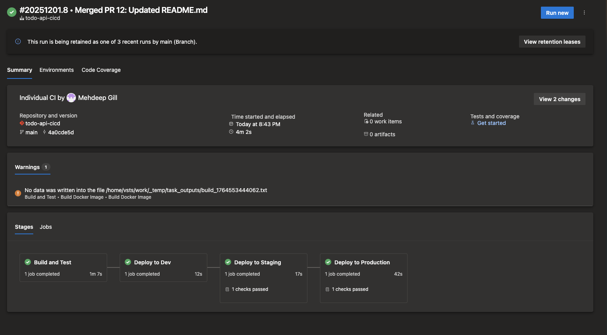

# Todo API - Azure DevOps CI/CD Pipeline

A production-ready CI/CD pipeline that deploys a containerized Node.js API to Azure Kubernetes Service using Azure DevOps. Features automated testing, security scanning, and blue-green deployments for zero-downtime releases.

## Overview

This project demonstrates a complete CI/CD workflow for containerized applications. The pipeline builds Docker images, runs tests, scans for vulnerabilities, and deploys to AKS across three environments (dev, staging, production) with manual approval gates.

**Key Features:**
- Multi-stage Azure DevOps pipeline
- Automated Docker builds and tests
- Security scanning with Trivy
- Blue-green deployment for production
- Environment-specific configurations
- Comprehensive smoke testing

## Architecture
```
┌─────────────────────────────────────────────────────────────────┐
│                    Azure DevOps Pipeline                        │
├─────────────────────────────────────────────────────────────────┤
│                                                                 │
│  ┌──────────────┐      ┌──────────────┐      ┌──────────────┐   │
│  │   Build      │ ───> │  Deploy Dev  │ ───> │Deploy Staging│   │
│  │              │      │              │      │              │   │
│  │ - Docker     │      │ - Auto       │      │ - Manual     │   │
│  │ - Tests      │      │ - Smoke Test │      │   Approval   │   │
│  │ - Trivy Scan │      │              │      │ - Smoke Test │   │
│  │ - Push ACR   │      │              │      │              │   │
│  └──────────────┘      └──────────────┘      └──────────────┘   │
│                                                       │         │
│                                                       ▼         │
│                                              ┌──────────────┐   │
│                                              │ Deploy Prod  │   │
│                                              │              │   │
│                                              │ - Manual     │   │
│                                              │   Approval   │   │
│                                              │ - Blue-Green │   │
│                                              │ - Zero       │   │
│                                              │   Downtime   │   │
│                                              └──────────────┘   │
└─────────────────────────────────────────────────────────────────┘
                              │
                              ▼
┌─────────────────────────────────────────────────────────────────┐
│                   Azure Kubernetes Service                      │
├─────────────────────────────────────────────────────────────────┤
│                                                                 │
│  ┌────────────┐   ┌────────────┐   ┌────────────────────────┐   │
│  │  todo-dev  │   │todo-staging│   │     todo-prod          │   │
│  │            │   │            │   │                        │   │
│  │  2 pods    │   │  2 pods    │   │  Blue: 2 pods  ◄─┐     │   │
│  │            │   │            │   │  Green: 0 pods    │    │   │
│  │  LB: IP1   │   │  LB: IP2   │   │                   │    │   │
│  └────────────┘   └────────────┘   │  Service switches │    │   │
│                                    │  traffic here ────┘    │   │
│                                    └────────────────────────┘   │
└─────────────────────────────────────────────────────────────────┘
```

## Screenshots

> **Note:** Screenshots will be added after deployment. See [SCREENSHOTS_GUIDE.md](SCREENSHOTS_GUIDE.md) for instructions on capturing screenshots.

### Pipeline Overview
<!-- Add screenshot of Azure DevOps pipeline running successfully -->
<!--  -->

### Kubernetes Deployment
<!-- Add screenshot of pods running in AKS -->
<!--  -->

### Application Running
<!-- Add screenshot of the Todo API homepage -->
<!--  -->

### Azure Container Registry
<!-- Add screenshot of container images in ACR -->
<!--  -->

## Tech Stack

<div align="center">

### Application


### Infrastructure & Cloud


### Tools & Security


</div>

**Technologies Used:**
- **Runtime:** Node.js 18, Express.js
- **Containerization:** Docker (multi-stage builds)
- **Orchestration:** Kubernetes (AKS)
- **CI/CD:** Azure DevOps Pipelines
- **Container Registry:** Azure Container Registry (ACR)
- **Security:** Trivy vulnerability scanning
- **Deployment Strategy:** Blue-Green deployments for zero-downtime

## Prerequisites

Before setting up this pipeline, you need:

- Azure subscription with:
  - AKS cluster deployed
  - Azure Container Registry created
  - Resource group with Contributor access
- Azure DevOps organization and project
- kubectl installed locally (for verification)
- Basic understanding of Kubernetes and Docker

## Setup Instructions

### 1. Azure DevOps Service Connections

Create three service connections in Azure DevOps:

**Azure Resource Manager:**
- Name: `azure-subscription`
- Type: Service Principal or Workload Identity
- Scope: Your subscription
- Grant access to all pipelines

**Azure Container Registry:**
- Name: `acr-connection`
- Registry: Select your ACR instance
- Service Principal authentication
- Grant access to all pipelines

**Kubernetes:**
- Name: `aks-connection`
- Authentication: Azure Subscription
- Cluster: Select your AKS cluster
- Namespace: Leave empty
- Grant access to all pipelines

### 2. Variable Group

Create a variable group named `todo-api-variables` in Azure DevOps with the following variables:
```
ACR_NAME: <your-acr-name>
ACR_LOGIN_SERVER: <your-acr-name>.azurecr.io
AKS_CLUSTER_NAME: <your-aks-cluster-name>
AKS_RESOURCE_GROUP: <your-aks-resource-group>
AZURE_SUBSCRIPTION: <your-subscription-id>
```

**Note:** Replace the values in angle brackets with your actual Azure resource names.

### 3. Environments with Approvals

Create three environments in Azure DevOps:

**dev:**
- No approvals (auto-deploy)

**staging:**
- Add approval: Configure approvers (yourself or team members)
- Branch control: Any branch

**production:**
- Add approval: Configure approvers (yourself or team members)
- Branch control: main branch only

### 4. Kubernetes Namespaces

Create the namespaces in your AKS cluster:
```bash
kubectl create namespace todo-dev
kubectl create namespace todo-staging
kubectl create namespace todo-prod
```

### 5. Configure Pipeline Variables

The pipeline uses variables from the `todo-api-variables` group. Ensure your service connection names match:
```yaml
variables:
  - name: dockerConnectionName
    value: 'acr-connection'  # Must match your ACR service connection name
  - name: k8sServiceConnection
    value: 'aks-connection'  # Must match your Kubernetes service connection name
```

**Note:** The ACR name and other Azure resource details are stored in the variable group, not hardcoded in the pipeline file.

### 6. Create and Run Pipeline

**If using GitHub:**
1. Ensure your code is pushed to GitHub
2. In Azure DevOps: Pipelines → Create Pipeline
3. Select **GitHub (YAML)**
4. Authorize Azure DevOps to access your GitHub account
5. Select your repository
6. Choose "Existing Azure Pipelines YAML file"
7. Select `/azure-pipelines.yml`
8. Save and run

**If using Azure Repos:**
1. Push code to Azure Repos
2. In Azure DevOps: Pipelines → New Pipeline
3. Select your repo
4. Choose "Existing Azure Pipelines YAML file"
5. Select `/azure-pipelines.yml`
6. Save and run

## Pipeline Stages

### Stage 1: Build (Automatic)

**What it does:**
1. Builds Docker image using multi-stage Dockerfile
2. Runs unit tests inside the container
3. Scans image for vulnerabilities with Trivy
4. Tags and pushes image to ACR

**Key features:**
- Tests run in the actual container (tests the artifact that will be deployed)
- Trivy fails pipeline on CRITICAL vulnerabilities
- Image tagged with build number for traceability

**Duration:** ~3-5 minutes

### Stage 2: Deploy to Dev (Automatic)

**What it does:**
1. Replaces tokens in K8s manifests (image name, build number)
2. Deploys to `todo-dev` namespace
3. Waits for pods to be ready
4. Runs smoke tests against LoadBalancer IP

**Smoke tests:**
- Waits up to 5 minutes for LoadBalancer IP (Azure can be slow)
- Tests `/health` endpoint for 200 response
- Tests `/api/todos` endpoint for 200 response
- Validates JSON responses with jq

**Duration:** ~5-8 minutes (mostly waiting for LoadBalancer)

### Stage 3: Deploy to Staging (Manual Approval)

**What it does:**
1. Requires manual approval in Azure DevOps
2. Same deployment process as dev
3. Deploys to `todo-staging` namespace
4. Runs same smoke tests

**When to approve:** 
- After verifying dev environment looks good
- Before deploying to production

**Duration:** ~5-8 minutes (after approval)

### Stage 4: Deploy to Production (Manual Approval + Blue-Green)

**What it does:**
1. Requires manual approval
2. Implements blue-green deployment for zero-downtime
3. Tests new deployment before switching traffic
4. Gracefully switches traffic between versions

**Blue-Green Process:**
```bash
# 1. Detect current active deployment
ACTIVE=$(kubectl get svc todo-api-service -n todo-prod -o jsonpath='{.spec.selector.version}')

# 2. Deploy to inactive slot (if active=blue, deploy to green)
kubectl set image deployment/todo-api-green ...
kubectl scale deployment/todo-api-green --replicas=2

# 3. Wait for new deployment to be ready
kubectl rollout status deployment/todo-api-green

# 4. Test new deployment via port-forward
kubectl port-forward pod/... 8080:3000
curl http://localhost:8080/health

# 5. Switch traffic by patching service selector
kubectl patch service todo-api-service -p '{"spec":{"selector":{"version":"green"}}}'

# 6. Scale down old deployment
kubectl scale deployment/todo-api-blue --replicas=0
```

**Why this matters:** If something goes wrong with the new version, you can instantly switch back to the old version by changing the service selector. No redeployment needed.

**Duration:** ~6-10 minutes (after approval)

## Testing the Deployed App

After deployment, get the LoadBalancer IP:
```bash
# Dev
kubectl get svc todo-api -n todo-dev

# Staging
kubectl get svc todo-api -n todo-staging

# Production
kubectl get svc todo-api-service -n todo-prod
```

Test the API:
```bash
# Health check
curl http://<EXTERNAL-IP>/health

# Get all todos
curl http://<EXTERNAL-IP>/api/todos

# Create a todo
curl -X POST http://<EXTERNAL-IP>/api/todos \
  -H "Content-Type: application/json" \
  -d '{"title":"Test from pipeline"}'

# Update a todo
curl -X PUT http://<EXTERNAL-IP>/api/todos/1 \
  -H "Content-Type: application/json" \
  -d '{"completed":true}'
```

## Project Structure
```
todo-api-cicd/
├── src/
│   ├── app.js              # Express app
│   ├── test.js             # Unit tests
│   └── package.json        # Dependencies
├── k8s/
│   ├── namespace.yaml      # Namespace definitions
│   ├── deployment.yaml     # Standard deployment (dev/staging)
│   ├── service.yaml        # LoadBalancer service
│   └── prod-deployment.yaml # Blue-green deployment for prod
├── Dockerfile              # Multi-stage build
├── .dockerignore          # Docker ignore rules
├── azure-pipelines.yml     # CI/CD pipeline
└── README.md              # This file
```

## Design Decisions

### Why Blue-Green for Production?

**Problem:** Rolling updates can cause issues during deployment (partial failures, version conflicts).

**Solution:** Blue-green deployment maintains two identical environments. Deploy to inactive, test it, then switch traffic. If something breaks, instantly switch back.

**Trade-off:** Uses 2x resources during deployment (both blue and green running). But worth it for zero-downtime and instant rollback.

### Why Test Inside Containers?

**Problem:** Tests on the pipeline host might pass but container might fail due to environment differences.

**Solution:** Run tests inside the actual Docker image that will be deployed. If tests pass, we know the container works.
```bash
# Not this:
npm test  # Tests on pipeline host

# This:
docker run <image> npm test  # Tests in actual container
```

### Why Wait for LoadBalancer IP?

**Problem:** Azure LoadBalancers take 2-5 minutes to provision. Pipeline would fail if we try to test immediately.

**Solution:** Retry logic that waits up to 5 minutes, checking every 10 seconds:
```bash
for i in {1..30}; do
  IP=$(kubectl get svc ...)
  if [ -n "$IP" ]; then break; fi
  sleep 10
done
```

### Why Port-Forward for Blue-Green Testing?

**Problem:** In blue-green deployment, the inactive slot doesn't have an external LoadBalancer. Can't test it directly.

**Solution:** Use kubectl port-forward to create a tunnel to the pod, test it locally, then switch traffic:
```bash
kubectl port-forward pod/green-pod 8080:3000 &
curl http://localhost:8080/health
# If healthy, switch traffic
```

## Troubleshooting

### Pipeline fails at Trivy scan

**Issue:** Image has CRITICAL vulnerabilities

**Solution:** 
```bash
# See what vulnerabilities were found
# Check the Trivy output in pipeline logs
# Update base image or dependencies
# Rebuild
```

### Smoke tests timeout waiting for LoadBalancer

**Issue:** Azure didn't assign LoadBalancer IP within 5 minutes

**Solution:**
```bash
# Check if service was created
kubectl get svc -n todo-dev

# Check events
kubectl get events -n todo-dev

# Manually get IP later
kubectl get svc todo-api -n todo-dev
```

### Blue-green deployment fails to switch

**Issue:** New deployment not healthy

**Solution:**
```bash
# Check pod status
kubectl get pods -n todo-prod -l version=green

# Check logs
kubectl logs -n todo-prod -l version=green

# Don't switch traffic until healthy
# Old version (blue) still serving traffic
```

### Can't push to ACR

**Issue:** Authentication or permission error

**Solution:**
- Check ACR service connection in Azure DevOps
- Verify service principal has AcrPush role
- Test manually: `az acr login --name <your-acr-name>`

## What I Learned

Building this pipeline taught me:

1. **Blue-green deployment is not just theory** - Implementing it for real shows you all the edge cases (testing inactive slot, handling failures, graceful cutover)

2. **Azure LoadBalancers are slow** - Always build retry logic. What works locally might timeout in cloud.

3. **Test the actual artifact** - Running tests on the pipeline host vs inside the container are different things. Always test what you deploy.

4. **Manual approvals matter** - Having a human check staging before prod catches issues that automation misses.

5. **Security scanning should fail pipelines** - If Trivy finds CRITICAL issues, the pipeline should stop. No vulnerable images in production.

## Future Improvements

Things I'd add with more time:

- [ ] Helm charts instead of raw YAML (more flexibility)
- [ ] Automated rollback on failed smoke tests
- [ ] Slack/Teams notifications for deployment status
- [ ] Performance testing stage
- [ ] Database migrations handling
- [ ] Canary deployment as alternative to blue-green
- [ ] Infrastructure as Code for AKS/ACR setup
- [ ] Multi-region deployment

## Resources

- [Azure DevOps Pipelines Docs](https://docs.microsoft.com/en-us/azure/devops/pipelines/)
- [Kubernetes Blue-Green Deployments](https://kubernetes.io/blog/2018/04/30/zero-downtime-deployment-kubernetes-jenkins/)
- [Trivy Security Scanner](https://aquasecurity.github.io/trivy/)
- [Azure Kubernetes Service](https://docs.microsoft.com/en-us/azure/aks/)

## License

MIT

---

**Built as part of my DevOps learning journey. Feedback welcome!**